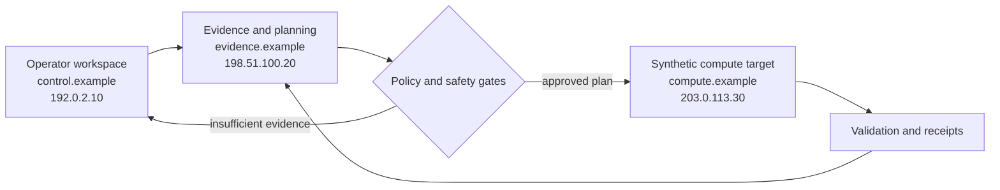

# Gumbii Digital

I build local AI infrastructure, evidence-gated automation, and operator tooling for systems that need to be understandable, testable, and recoverable.

My work connects physical infrastructure, distributed compute, networking, model operations, validation, and technical documentation. I focus on the part that is often skipped: proving what a system did, defining when automation must refuse to act, and leaving behind artifacts another engineer can inspect.

## What I build

- Local multi-system AI infrastructure and operating methods
- Evidence-gated network diagnostics and change planning
- Guarded recovery systems with refusal, cooldown, verification, and rollback
- Reproducible model-serving, quantization, and benchmark workflows
- Privacy-safe engineering documentation, case studies, and publication checks

## Selected public work

Each project below is a clean public publication surface. The case studies, architecture documents, synthetic JSON artifacts, and automated safety checks are available in the repository - not hidden behind a summary claim.

| Project | What it demonstrates | Inspect the work |
| --- | --- | --- |
| [DGX Cluster](https://github.com/GumbiiDigital/dgx-cluster-public) | Validation, observability, repeatability, and operations discipline for local multi-system AI infrastructure | [Case study](https://github.com/GumbiiDigital/dgx-cluster-public/blob/main/docs/CASE-STUDY.md) / [Architecture](https://github.com/GumbiiDigital/dgx-cluster-public/blob/main/docs/ARCHITECTURE.md) / [Synthetic evidence](https://github.com/GumbiiDigital/dgx-cluster-public/blob/main/examples/synthetic-cluster-observation.json) |
| [Gumbii Digital DGX Spark Lab Notes (Unofficial)](https://github.com/GumbiiDigital/dgx-spark-playbooks-public) | Independently maintained workflow notes with prerequisites, gates, evidence, rollback, and acceptance criteria | [Case study](https://github.com/GumbiiDigital/dgx-spark-playbooks-public/blob/main/docs/CASE-STUDY.md) / [Architecture](https://github.com/GumbiiDigital/dgx-spark-playbooks-public/blob/main/docs/ARCHITECTURE.md) / [Synthetic workflow](https://github.com/GumbiiDigital/dgx-spark-playbooks-public/blob/main/examples/synthetic-playbook-workflow.json) |
| [Evidence-Gated Network Agent](https://github.com/GumbiiDigital/dgx-routeros-agent-public) | JSON-first discovery, fixed evidence gates, confirm-to-apply controls, rollback, and reporting | [Case study](https://github.com/GumbiiDigital/dgx-routeros-agent-public/blob/main/docs/CASE-STUDY.md) / [Architecture](https://github.com/GumbiiDigital/dgx-routeros-agent-public/blob/main/docs/ARCHITECTURE.md) / [Synthetic plan](https://github.com/GumbiiDigital/dgx-routeros-agent-public/blob/main/examples/synthetic-change-plan.json) |
| [Network-Agent Research Flywheel](https://github.com/GumbiiDigital/dgx-routeros-agent-rsl-flywheel-public) | Sanitized corpus design, holdout evaluation, quarantine, and privacy/action-safety promotion gates | [Case study](https://github.com/GumbiiDigital/dgx-routeros-agent-rsl-flywheel-public/blob/main/docs/CASE-STUDY.md) / [Architecture](https://github.com/GumbiiDigital/dgx-routeros-agent-rsl-flywheel-public/blob/main/docs/ARCHITECTURE.md) / [Synthetic evaluation](https://github.com/GumbiiDigital/dgx-routeros-agent-rsl-flywheel-public/blob/main/examples/synthetic-evaluation-record.json) |
| [Guarded Power Recovery](https://github.com/GumbiiDigital/dgx-spark-guarded-power-recovery-public) | Multi-signal recovery decisions, refusal logic, cooldown, state verification, and rollback principles | [Case study](https://github.com/GumbiiDigital/dgx-spark-guarded-power-recovery-public/blob/main/docs/CASE-STUDY.md) / [Architecture](https://github.com/GumbiiDigital/dgx-spark-guarded-power-recovery-public/blob/main/docs/ARCHITECTURE.md) / [Synthetic decision](https://github.com/GumbiiDigital/dgx-spark-guarded-power-recovery-public/blob/main/examples/synthetic-recovery-decision.json) |
| [GLM 5.2 on DGX Spark](https://github.com/GumbiiDigital/glm-5-2-on-dgx-spark-public) | Version-pinned operations, dry-run validation, distributed serving plans, and reproducible checks | [Case study](https://github.com/GumbiiDigital/glm-5-2-on-dgx-spark-public/blob/main/docs/CASE-STUDY.md) / [Architecture](https://github.com/GumbiiDigital/glm-5-2-on-dgx-spark-public/blob/main/docs/ARCHITECTURE.md) / [Synthetic serving plan](https://github.com/GumbiiDigital/glm-5-2-on-dgx-spark-public/blob/main/examples/synthetic-serving-plan.json) |
| [Spark NVFP4 Lab](https://github.com/GumbiiDigital/spark-nvfp4-lab-public) | Provenance, repeatable quantization and benchmarking, quality gates, and candid limitation tracking | [Case study](https://github.com/GumbiiDigital/spark-nvfp4-lab-public/blob/main/docs/CASE-STUDY.md) / [Architecture](https://github.com/GumbiiDigital/spark-nvfp4-lab-public/blob/main/docs/ARCHITECTURE.md) / [Synthetic benchmark](https://github.com/GumbiiDigital/spark-nvfp4-lab-public/blob/main/examples/synthetic-benchmark-record.json) |

## How I engineer systems

1. Prove identity and current state before acting.
2. Separate observations, measurements, plans, actions, results, and unknowns.
3. Define acceptance criteria and rollback before risky work.
4. Require evidence gates for changes; refuse when evidence is incomplete.
5. Treat a green test as evidence for a specific claim, not proof of everything.
6. Publish the method and artifacts without publishing the live environment.

## Synthetic public architecture

The diagram below is fictional and uses reserved documentation addresses. It demonstrates the engineering pattern only; it does not reproduce or approximate a live topology.

## Defensible by design

The public repositories are built so a reader can inspect more than prose:

- Case studies explain the problem, engineering choices, evidence, and limitations.
- Architecture documents show the public-safe system model.
- JSON examples make contracts and decision records concrete.
- Standard-library safety checkers scan every repository for prohibited private data.
- GitHub Actions rerun the publication-safety check on every change.

The examples are intentionally synthetic. They support review of the method without creating live deployment claims.

## Publication boundary

I do not publish live addresses, hostnames, hardware identifiers, account names, local paths, credentials, raw telemetry, service inventories, physical layouts, outlet maps, controller identities, or operational topology. Public examples use reserved documentation addresses and fictional names. Future technical material is added only after privacy review.

For project-specific questions, open an issue in the relevant public repository.
